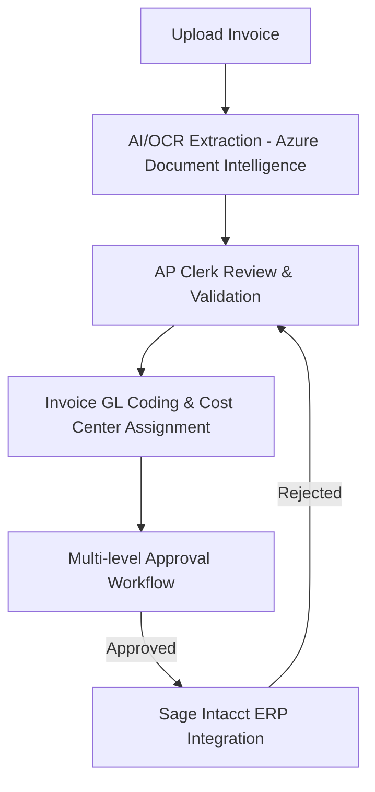

# APEX - Accounts Payable

An automated Accounts Payable (APEX) management platform that orchestrates the entire journey of an invoice—from ingestion and AI-driven data extraction to multi-level approval workflows, GL coding, and Sage Intacct integration.

---

## 🚀 Overview

The **APEX Accounts Payable** streamlines manual invoice processing by leveraging AI and automation. It eliminates data-entry bottlenecks, automates approval routing, maintains compliance logs, and integrates directly with external ERP systems like Sage Intacct.



---

## 🛠️ Technology Stack

| Layer | Technology | Details |
| :--- | :--- | :--- |
| **Frontend UI** | React 19, Vite, Tailwind CSS v4, Ant Design (`antd`) | Modern, highly responsive SPA utilizing AG-Grid for lists and Plotly.js for dashboards. |
| **Frontend State** | Zustand, React Query | Client-side caching and global state management. |
| **Backend API** | Python 3, FastAPI, Uvicorn | High-performance, asynchronous RESTful API framework. |
| **ORM & Database** | SQLAlchemy, Microsoft SQL Server | Relational database mapping with SQL Server integration (via pure Python `pymssql` driver). |
| **AI & Document Processing** | Azure AI Document Intelligence, Azure OpenAI (GPT-3.5 Turbo) | Advanced OCR, layout extraction, and LLM-based parsing. |
| **Integrations** | Sage Intacct API | Direct OAuth2 synchronization of vendors, GL accounts, and posting of bills. |
| **Testing** | Playwright | Robust E2E and integration testing suite for critical user flows. |

---

## ✨ Key Features (Use Cases)

Based on the [End-to-End Use Case Document (UCD)](./ucd-document.md):

*   **🔒 UC-01: Authentication & Authorization**
    *   Secure local authentication with JWT.
    *   Single Sign-On (SSO) OAuth2 integrations.
*   **📊 UC-02: Interactive Dashboard & Analytics**
    *   Real-time metrics on pending invoices, approval queues, and processed volumes.
    *   Interactive data visualizations powered by Plotly.
*   **📥 UC-03: Invoice Upload & AI/OCR Processing**
    *   Support for multiple file formats.
    *   Cognitive AI extraction mapping vendor, dates, line items, totals, tax, and currency.
*   **🔍 UC-04: Review & Validation**
    *   Split-screen UI showing the PDF document alongside extracted metadata.
    *   Error highlighting and inline correction.
*   **🧾 UC-05: GL Coding & Allocations**
    *   Assigning GL accounts, cost centers, and departments to invoice line items.
*   **✅ UC-06: Approval Workflow Routing**
    *   Dynamically routes invoices based on delegation rules, dollar thresholds, and departments.
    *   Supports single-click approval, rejection, and request-for-info loops.
*   **🗂️ UC-07: Master Data Sync**
    *   Reference data synchronization (Vendors, GL Accounts, Cost Centers, Currencies) from Sage Intacct.
*   **⚙️ UC-08: System Administration & Workflow Configuration**
    *   User role management, approval limits, and company configuration settings.
*   **🔄 UC-09: Delegation & Audit Tracking**
    *   Dynamic out-of-office delegation scheduling.
    *   Detailed transaction-level audit logs tracking every modification and action.

---

## 📂 Project Directory Structure

```text
APEX/
├── backend/                  # FastAPI Backend Code
│   ├── app/
│   │   ├── auth/             # Authentication & JWT logic
│   │   ├── database/         # SQL Server init, seed, and models
│   │   ├── routes/           # API endpoints (invoices, GL, master data, etc.)
│   │   ├── services/         # Business logic & Azure AI / Sage integrations
│   │   └── main.py           # FastAPI entrypoint
│   ├── .env                  # Configuration variables (secrets, URLs)
│   ├── requirements.txt      # Python dependencies
│   └── run.py                # Server runner script (port 8014)
│
├── frontend/                 # React Frontend Code
│   ├── src/                  # Components, pages, router, queries, hooks
│   ├── public/               # Public assets
│   ├── tests/                # Playwright E2E tests (login, register, dashboard, etc.)
│   ├── package.json          # Node dependencies and npm scripts
│   └── vite.config.js        # Vite build tool config (port 3003)
│
├── automate_build.py         # Git merge + packaging utility script
└── README.md                 # System overview (this file)
```

---

## ⚡ Getting Started

### Prerequisites

*   **Python**: Version 3.10 or higher.
*   **Node.js**: Version 18 or higher (LTS recommended).
*   **SQL Server**: A local or remote Microsoft SQL Server database.

---

### 1. Backend Setup

1.  **Navigate to the backend directory**:
    ```bash
    cd backend
    ```

2.  **Create and activate a virtual environment**:
    ```bash
    python -m venv .venv
    # Windows:
    .venv\Scripts\activate
    # macOS/Linux:
    source .venv/bin/activate
    ```

3.  **Install dependencies**:
    ```bash
    pip install -r requirements.txt
    ```

4.  **Configure environment variables**:
    Copy `.env` settings and ensure your database connection, Azure cognitive keys, and Sage integration variables are populated correctly. Refer to the comments in `backend/.env`.

5.  **Initialize the Database and Run the API**:
    ```bash
    python run.py
    ```
    *   On startup, FastAPI will automatically initialize the SQL Server database schema and seed master data if they do not exist.
    *   The API server will run locally at **`http://localhost:8014`**.
    *   You can view interactive Swagger documentation at **`http://localhost:8014/docs`**.

---

### 2. Frontend Setup

1.  **Navigate to the frontend directory**:
    ```bash
    cd ../frontend
    ```

2.  **Install dependencies**:
    ```bash
    npm install
    ```

3.  **Start the Vite development server**:
    ```bash
    npm run dev
    ```
    *   The web application will run at **`http://localhost:3003`** (or the port defined in your configurations).

---

## 🧪 Testing

The frontend is configured with Playwright for complete browser-based end-to-end testing of key modules.

To execute tests, navigate to the `frontend` folder and run the commands below:

```bash
# Run all registration flow tests
npm run test:register

# Run all login flow tests
npm run test:login

# Run dashboard flow tests
npm run test:dashboard

# Run invoice processing validation tests
npm run test:invoices

# Open Playwright UI for interactive visual testing
npm run test:login:ui
```

---

## 📦 Build & Release Automation

A custom script, `automate_build.py`, is provided at the root level to automate merging active feature branches into `main` and creating clean deployment packages.

To package the application:
1. Run the script from the root directory:
   ```bash
   python automate_build.py
   ```
2. Enter the feature branch name when prompted.
3. The script will perform the following steps:
   * Checkout the specified branch, pull changes.
   * Checkout `main`, pull changes.
   * Merge the feature branch into `main`.
   * Push the updated `main` to the origin repository.
   * Clean `__pycache__` directories in the backend.
   * Create `backend.zip` (excluding configuration data and uploaded files).
   * Create `frontend.zip` (excluding `node_modules` and compiled `dist` folders).
